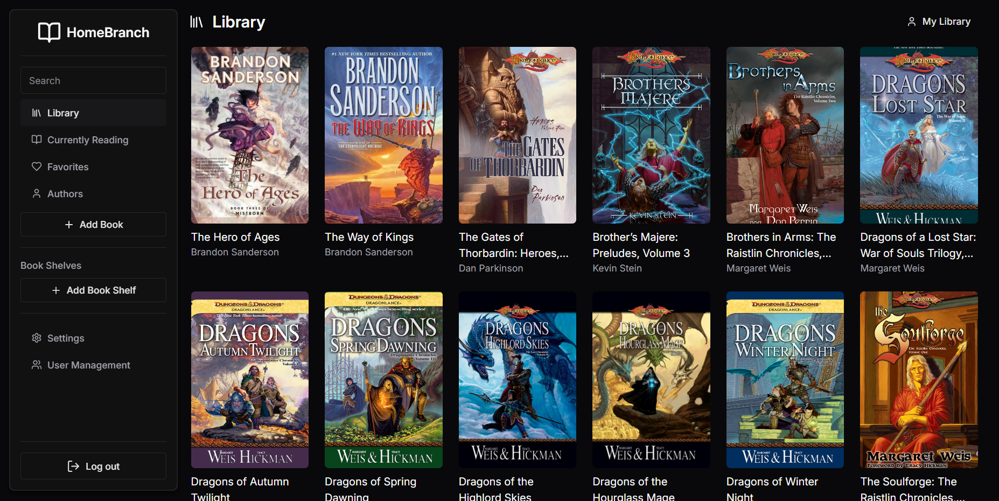
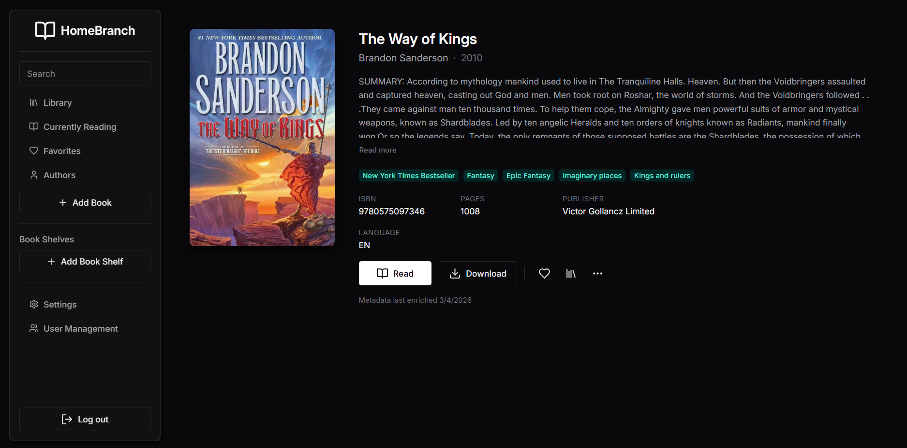
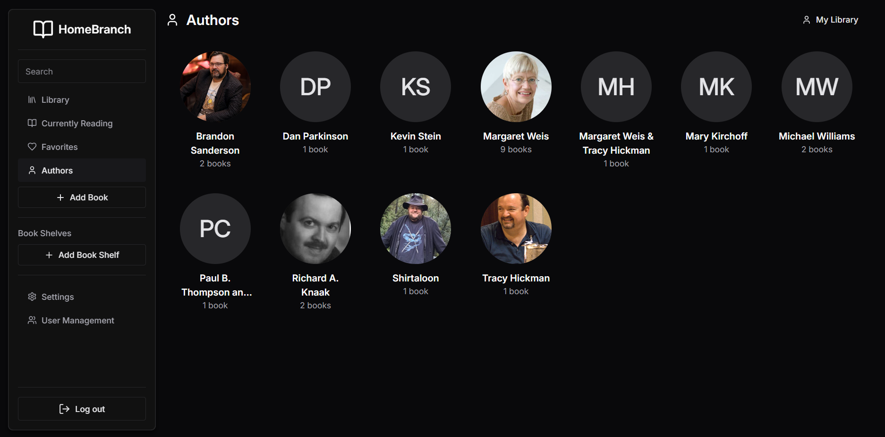

# Homebranch

Homebranch is a self-hosted web application for managing and reading your E-Book collection. 
It provides a user-friendly interface to organize, search, and read your ebooks across devices.

> [!NOTE]
> The project is split into 3 repositories allowing you to choose the components you want to use:
> - [Homebranch Web](https://github.com/Oghamark/homebranch-web): The frontend web application built with React and TypeScript
> - [Homebranch](https://github.com/Oghamark/homebranch): The backend API built with NestJS and TypeScript
> - [Authentication](https://github.com/Oghamark/Authentication): A standalone authentication service built with NestJS and TypeScript, which can be used with Homebranch or as a general-purpose auth service for other applications

---

## Preview

---

## Features

- EPUB reader with cross-device position sync
- Library with infinite scroll and search
  - Keyword search: `isbn:<value>`, `genre:<value>`, `series:<value>`, `author:<value>` prefixes narrow results by metadata field
- Book detail page with enriched metadata: genres, series, ISBN, page count, publisher, language, ratings
- Automatic metadata enrichment from Open Library and Google Books on upload
- Book shelves (collections)
- Currently Reading and Favorites lists
- Dark and light mode
- User management and roles
- Book upload (up to 50 MB)

---

## Installation

See our [documentation](https://homebranch.app/docs/getting-started/) for installation and configuration instructions.

---

## Contributing

Contributions are welcome! Please see our [contribution guidelines](https://github.com/Oghamark/homebranch-web/blob/main/CONTRIBUTING.md)  for details on how to get involved.
