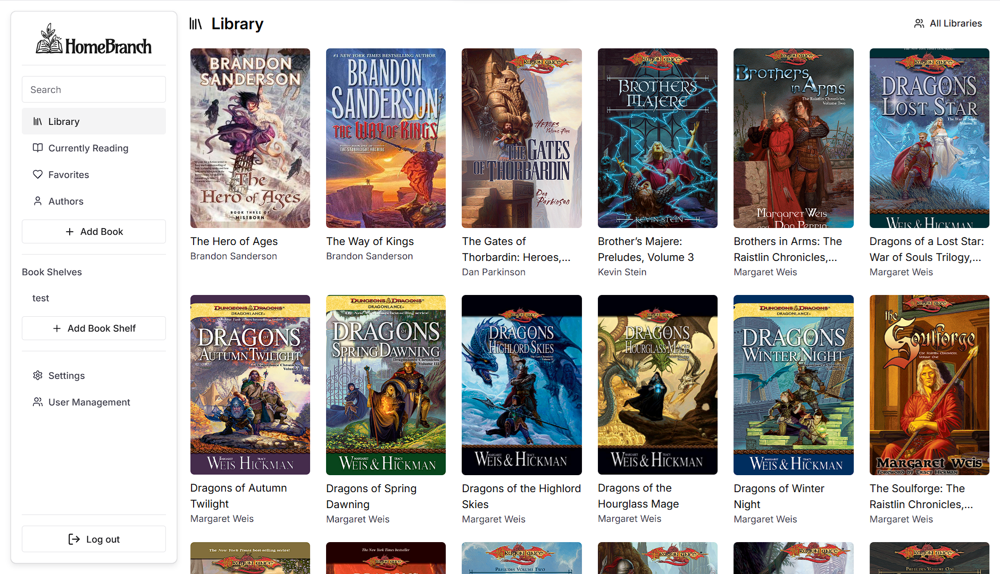
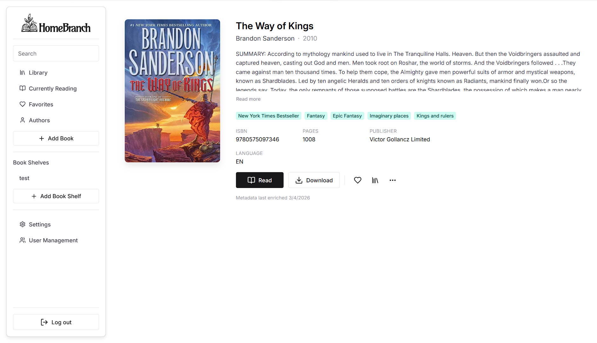
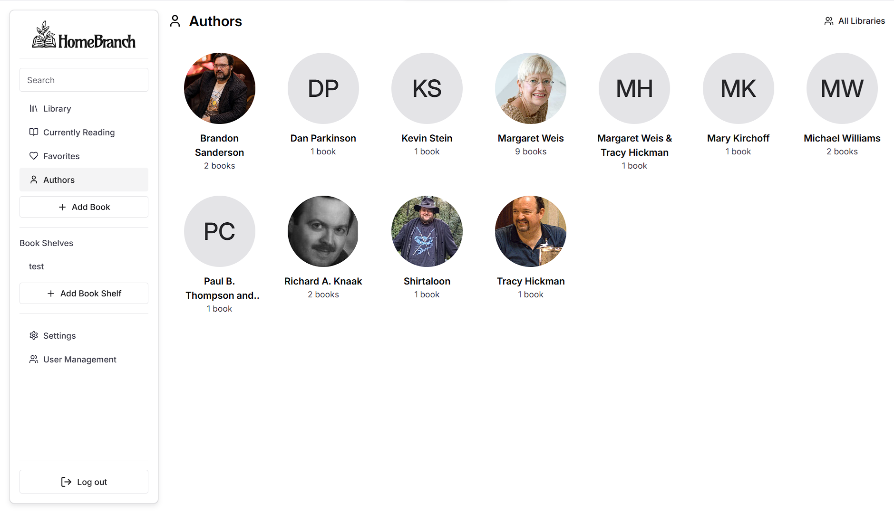

<picture>
  <source media="(prefers-color-scheme: dark)" srcset="public/Logo%202-Color%20For%20Dark.svg">
  
</picture>

Homebranch is a self-hosted web application for managing and reading your E-Book collection. 
It provides a user-friendly interface to organize, search, and read your ebooks across devices.

> [!NOTE]
> The project is split into 3 repositories allowing you to choose the components you want to use:
> - [Homebranch Web](https://github.com/Oghamark/homebranch-web): The frontend web application built with React and TypeScript
> - [Homebranch](https://github.com/Oghamark/homebranch): The backend API built with NestJS and TypeScript
> - [Authentication](https://github.com/Oghamark/Authentication): A standalone authentication service built with NestJS and TypeScript, which can be used with Homebranch or as a general-purpose auth service for other applications

---

## Preview

<picture>
  <source media="(prefers-color-scheme: dark)" srcset="images/library_view.png">
  
</picture>
<picture>
  <source media="(prefers-color-scheme: dark)" srcset="images/book_details_view.png">
  
</picture>
<picture>
  <source media="(prefers-color-scheme: dark)" srcset="images/authors_view.png">
  
</picture>

---

## Features

- EPUB and PDF in-browser reading — Readium powers the EPUB reader, while PDF reading is built into the web app with shared position sync
- Library with infinite scroll and search
  - Keyword search: `isbn:<value>`, `genre:<value>`, `series:<value>`, `author:<value>` prefixes narrow results by metadata field
- Book detail page with enriched metadata and format-aware actions: genres, series, ISBN, page count, publisher, language, ratings, format selection, and linked-format management
- Automatic metadata enrichment from Open Library and Google Books on upload
- Book shelves (collections)
- Currently Reading and Favorites lists
- Dark and light mode
- User management and roles
- EPUB and PDF upload (up to 50 MB)
- SSO login via OIDC (configurable in the Settings page)
- Library Management page (admin): paginated job history with status filtering, book ownership management, linked-format maintenance, and book deduplication
- Real-time library updates via SSE — new, removed, or updated books reflect automatically without a manual page refresh; job progress streams live as jobs run

---

## Installation

See our [documentation](https://homebranch.app/docs/getting-started/) for installation and configuration instructions.

---

## Contributing

Contributions are welcome! Please see our [contribution guidelines](CONTRIBUTING.md)  for details on how to get involved.

---

## Credits

- "HomeBranch" Logo and Iconography  © 2026 [Acro Visuals, L.L.C.](https://acrovisuals.com) is licensed under CC BY-SA 4.0. To view a copy of this license, visit https://creativecommons.org/licenses/by-sa/4.0/
